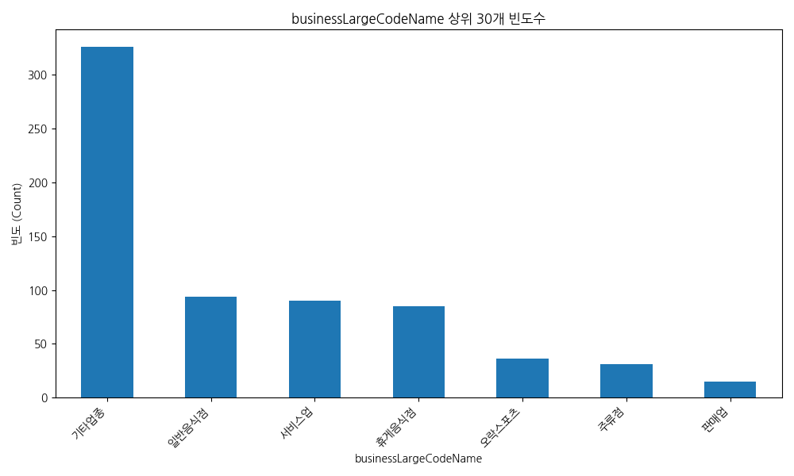
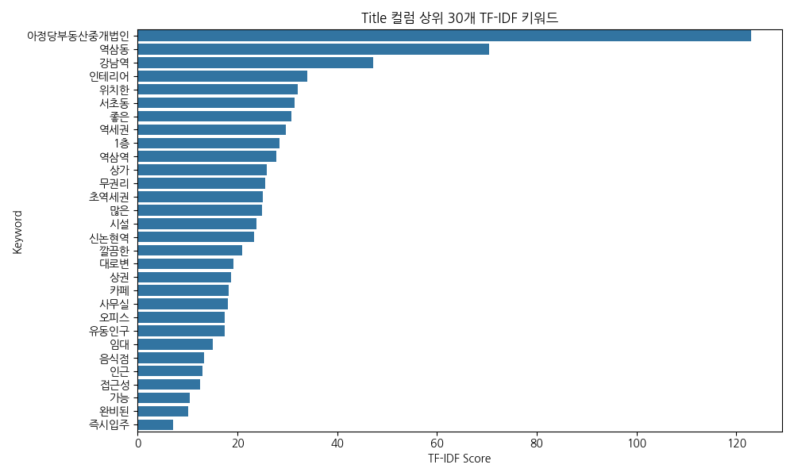
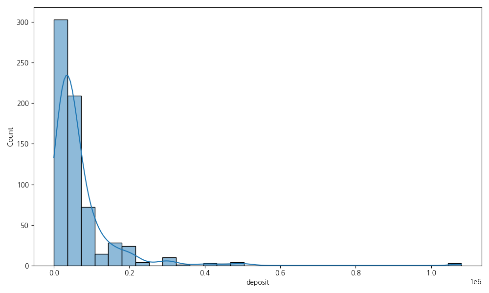
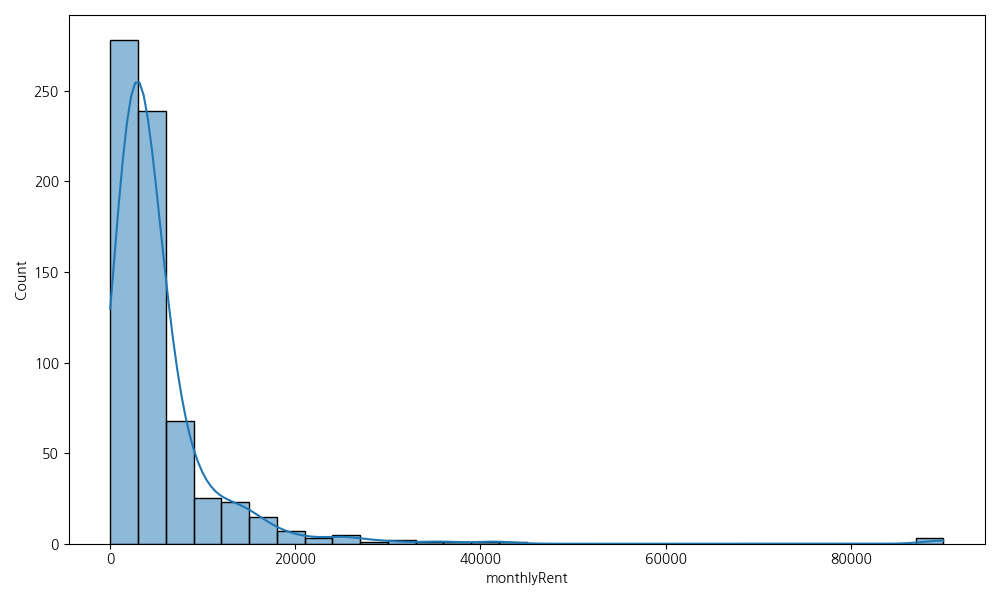
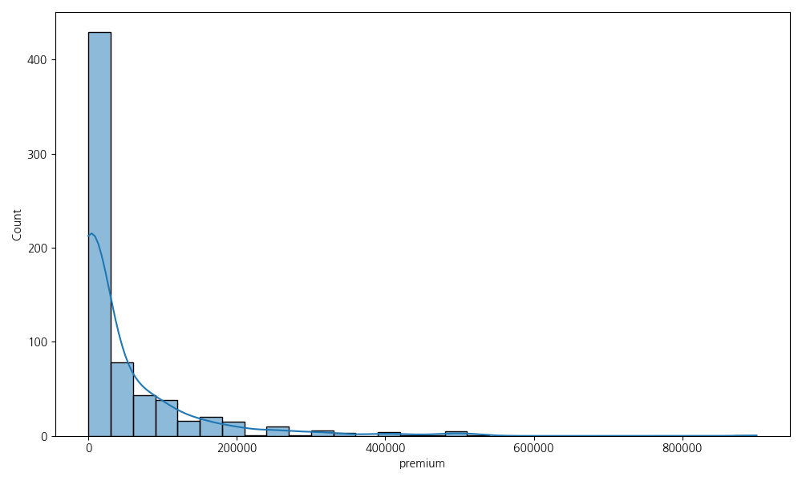
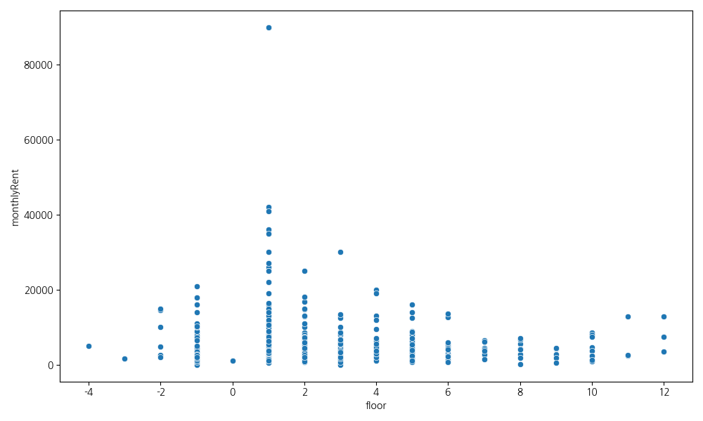
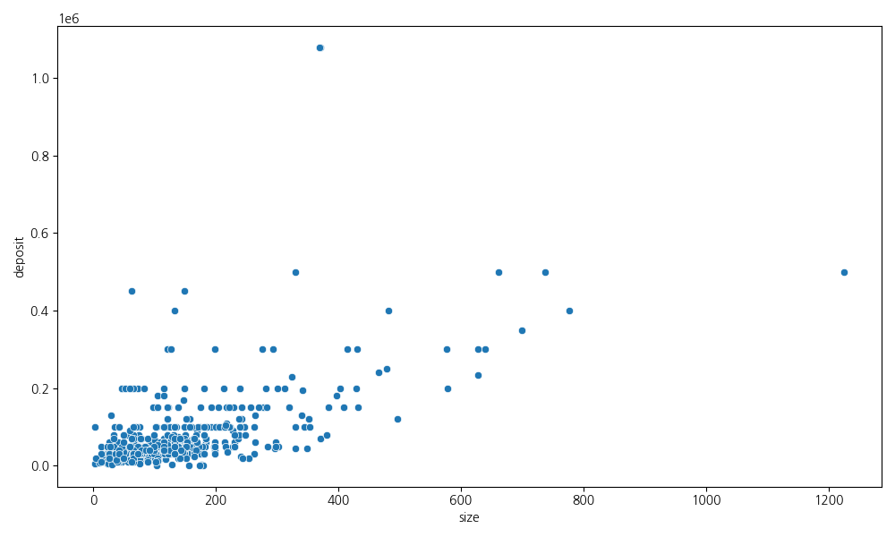
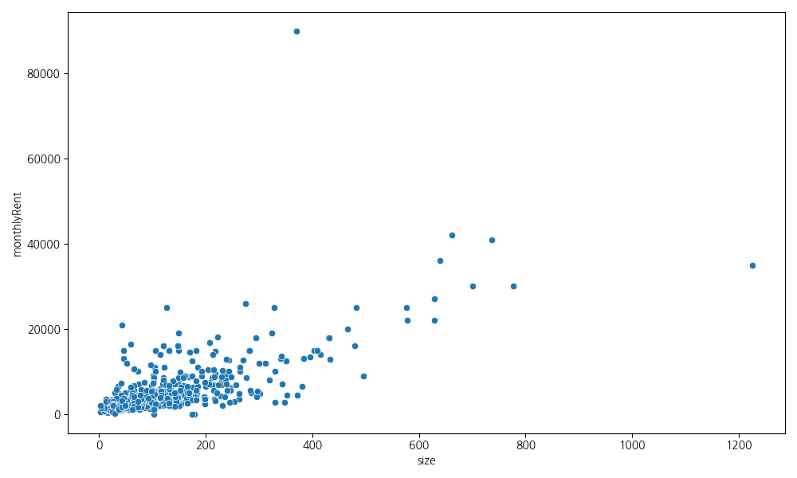
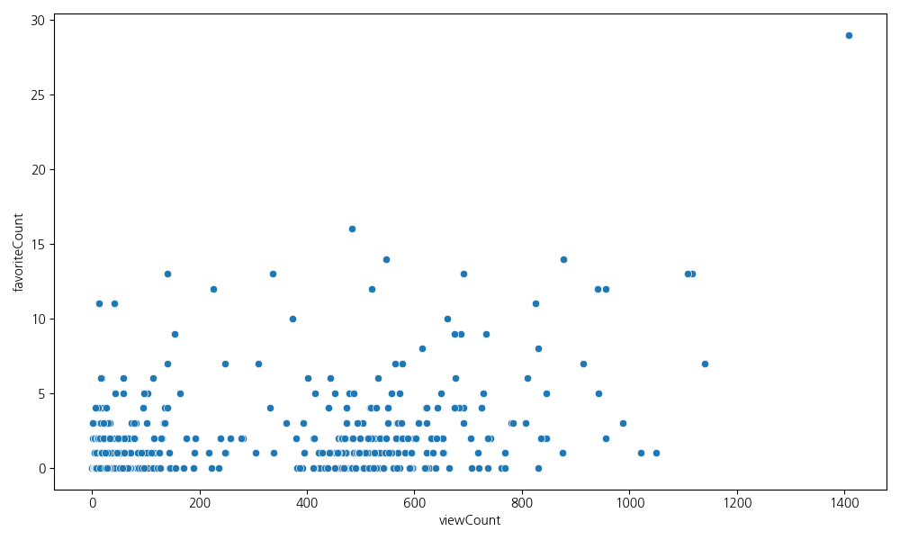

# 네모 상가 데이터 심층 분석
## Premium Business Insights

**작성일**: 2026-04-29
**데이터 수**: 673건

<!-- 
발표자 노트:
안녕하세요. 오늘 발표를 맡은 AI 분석 어시스턴트입니다. 
본 분석은 '네모 상가 데이터' 673건을 바탕으로 상업용 부동산 시장의 현황과 비즈니스 기회를 포착하기 위해 수행되었습니다. 
단순한 수치 나열을 넘어, 실제 창업자나 투자자가 현장에서 체감할 수 있는 실질적인 인사이트를 도출하는 데 초점을 맞췄습니다. 
673건의 데이터는 강남과 역삼동을 중심으로 한 핵심 상권의 최신 트렌드를 반영하고 있으며, 40여 개의 변수를 통해 입지, 가격, 업종, 소비자 반응을 다각도로 분석했습니다. 
오늘 이 자리를 통해 데이터가 말해주는 상권의 이면과 우리가 나아가야 할 전략적 방향에 대해 심도 있게 논의해보겠습니다.
-->

---

# 1. 데이터 프로파일링 요약

| 항목 | 수치 |
| :--- | :--- |
| **총 행(Row) 수** | 673개 |
| **총 열(Column) 수** | 40개 |
| **중복 데이터** | 0개 |
| **평균 보증금** | 약 6,895만 원 |
| **평균 권리금** | 약 4,640만 원 |

<!-- 
발표자 노트:
본격적인 분석에 앞서 전체적인 데이터의 규모와 품질을 살펴보겠습니다. 
우리는 총 673개의 유니크한 매물 데이터를 분석에 활용했습니다. 중복 데이터가 0개라는 점은 분석의 신뢰도를 높여주는 중요한 지표입니다. 
주목해야 할 점은 평균 보증금과 권리금의 수치입니다. 평균 보증금은 약 6,890만 원, 권리금은 4,640만 원 수준으로 나타났습니다. 
하지만 이 수치는 단순히 평균일 뿐, 실제 상권별로는 매우 큰 편차를 보이고 있습니다. 
특히 40개의 컬럼에는 층수, 면적, 조회수뿐만 아니라 주차 가능 여부나 엘리베이터 유무와 같은 미세한 옵션 데이터까지 포함되어 있어, 향후 정밀한 회귀 분석이나 머신러닝 모델링으로 확장할 수 있는 충분한 잠재력을 가지고 있습니다. 
이 기초 체력을 바탕으로 다음 장에서 본격적인 핵심 인사이트를 짚어보겠습니다.
-->

---

# 2. 핵심 비즈니스 인사이트 💡

1. **상권 양극화**: 강남/역삼 등 핵심 상권의 프라임 매물이 평균 가격을 견인하는 멱법칙 분포 확인.
2. **무권리 매물 급증**: 데이터의 절반 이상이 무권리. 소자본 창업의 기회이자 상권 쇠퇴 리스크 공존.
3. **입지 편중**: 강남역, 역삼역 인근에 매물이 고도로 집중. 2030 직장인 타겟 전략 필수.

<!-- 
발표자 노트:
데이터를 통해 도출된 가장 중요한 세 가지 비즈니스 포인트를 말씀드리겠습니다. 
첫째, 상권의 양극화가 뚜렷합니다. 상위 10%의 매물이 전체 거래 가액의 상당 부분을 차지하는 멱법칙 분포를 보이고 있습니다. 이는 강남과 역삼이라는 지역적 특성이 가격 형성에 절대적인 영향을 미치고 있음을 의미합니다. 
둘째, 무권리 매물의 비중이 생각보다 높다는 점입니다. 이는 초기 비용을 절감하고자 하는 예비 창업자들에게는 기회일 수 있으나, 동시에 해당 상권의 회전율이 높거나 소비력이 예전만 못하다는 경고 신호로도 해석될 수 있습니다. 
셋째, 입지의 편중성입니다. 강남역과 역삼역 반경 500m 이내에 매물이 밀집되어 있습니다. 
결론적으로, 현재 시장은 '초양극화' 시대로 접어들었으며, 단순히 감에 의존한 출점이 아닌 철저하게 2030 직장인의 유동 인구와 소비 패턴을 분석한 입지 선정이 생존의 열쇠가 될 것입니다.
-->

---

# 3. 업종별 빈도 분석

- **기타업종**(325건), **일반음식점**(96건) 순으로 비중이 높음.
- 요식업 및 서비스업의 치열한 경쟁 환경 시사.

<!-- 
발표자 노트:
업종별 분포를 시각화한 자료입니다. 보시다시피 '기타 업종'과 '일반 음식점'이 압도적인 비중을 차지하고 있습니다. 
여기서 '기타 업종'은 사무실이나 특수 서비스업 등을 포함하고 있는데, 이는 강남/역삼 지역이 단순히 소비 상권일 뿐만 아니라 거대한 오피스 타운임을 방증합니다. 
일반 음식점의 높은 빈도는 우리가 흔히 말하는 '레드오션'의 전형을 보여줍니다. 많은 이들이 요식업 창업을 희망하지만, 그만큼 폐업률과 매물 출회 빈도도 높다는 것을 의미합니다. 
분석 결과, 상권의 지속 가능성을 위해서는 단순 음식점보다는 오피스 인구의 라이프스타일을 파고드는 복합 서비스 모델이나 특색 있는 테마가 필수적입니다. 
그래프의 꼬리 부분에 해당하는 소수 업종들이 오히려 틈새 시장으로서의 가치가 높을 수 있다는 점을 전략적으로 검토해볼 필요가 있습니다.
-->

---

# 4. 키워드 분석 (TF-IDF)

- **주요 키워드**: 역삼동, 강남역, 인테리어, 무권리, 초역세권.
- 수요자들은 '입지'와 '즉시 영업 가능성'을 최우선으로 고려함.

<!-- 
발표자 노트:
매물 설명 텍스트를 TF-IDF 알고리즘으로 분석하여 추출한 핵심 키워드 클라우드입니다. 
가장 크게 보이는 키워드는 역시 '역삼동'과 '강남역'입니다. 부동산에서 '입지'는 결코 변하지 않는 제1원칙임을 데이터가 다시 한번 증명하고 있습니다. 
흥미로운 점은 '인테리어'와 '무권리'라는 키워드의 빈도가 매우 높다는 것입니다. 
이는 매물을 내놓는 사람이나 구하는 사람 모두 '비용 절감'과 '속도'에 민감하다는 것을 보여줍니다. 
새로 인테리어를 하기보다는 기존 시설을 그대로 승계하여 바로 영업을 시작할 수 있는 매물이 시장에서 가장 활발하게 논의되고 있습니다. 
따라서 공실 상태의 매물보다는 '시설 권리금이 합리적이거나 없는' 상태의 매물을 선점하는 것이 초기 투자 회수 기간(ROI)을 단축하는 핵심 전략이 될 것입니다.
-->

---

# 5. 임대료 분포 분석 (보증금/월세)

  
  

- **Right-Skewed**: 대다수는 저렴한 매물이나, 일부 프라임 매물이 가격 평균을 높임.

<!-- 
발표자 노트:
임대료의 분포도를 보겠습니다. 왼쪽은 보증금, 오른쪽은 월세의 분포입니다. 
두 그래프 모두 왼쪽으로 치우친(Right-Skewed) 형태를 띠고 있습니다. 즉, 대다수의 매물은 우리가 흔히 생각하는 시장 가격대에 모여 있지만, 우측 끝부분에 위치한 극소수의 프라임 매물들이 엄청난 고가를 형성하고 있습니다. 
이러한 분포에서는 '평균값'의 함정에 빠지기 쉽습니다. 소수의 초고가 매물이 평균을 크게 끌어올리기 때문입니다. 
따라서 실제 의사결정을 할 때는 평균값보다는 '중앙값(Median)'을 기준으로 삼아야 현실적인 예산 수립이 가능합니다. 
강남이라고 해서 무조건 비싼 것만은 아니며, 이 분포 안에서 우리 예산에 맞는 '가성비 구간'을 찾아내는 것이 데이터 분석의 실질적인 목표 중 하나입니다.
-->

---

# 6. 상권 가치: 권리금 및 층수

  
  

- **1층 프리미엄**: 도로 접점인 1층의 월세가 압도적으로 높음.
- 목적형 업종은 2층 이상으로 진입하여 고정비 절감 권장.

<!-- 
발표자 노트:
층수별 임대료와 권리금의 상관관계를 분석했습니다. 
예상대로 1층 매물의 월세와 권리금이 타 층수에 비해 압도적으로 높게 형성되어 있습니다. '가시성'과 '접근성'에 대한 비용 지불이 일어나는 것이죠. 
하지만 여기서 전략적인 선택이 필요합니다. 만약 여러분의 사업이 워크인 고객보다 예약제나 SNS 마케팅에 의존하는 '목적형 업종'이라면, 굳이 비싼 1층을 고집할 필요가 있을까요? 
2층이나 지하실을 활용한다면 1층 대비 월세는 40~50% 수준까지 절감하면서도 더 넓은 면적을 확보할 수 있습니다. 
실제로 최근 성수동이나 강남의 힙한 매장들은 접근성보다는 독특한 공간 경험을 제공하며 고층이나 지하에서도 성공하고 있습니다. 
고정비 절감이야말로 가장 확실한 수익 창출의 시작임을 잊지 말아야 합니다.
-->

---

# 7. 면적 대비 가성비 분석

  
  

- 회귀선 하단 매물을 공략하여 효율적인 공간 확보 가능.

<!-- 
발표자 노트:
면적과 임대료 사이의 선형 회귀 분석 그래프입니다. 
일반적으로 면적이 넓어질수록 임대료가 상승하는 것은 당연하지만, 그래프상의 점들을 보시면 회귀선에서 멀리 떨어진 매물들이 보입니다. 
특히 회귀선 아래쪽에 위치한 점들은 '면적 대비 가격이 저렴한' 소위 가성비 매물들입니다. 반대로 선 위쪽은 입지 프리미엄이 과도하게 붙었거나 고평가된 매물일 확률이 높습니다. 
우리는 이 '언더밸류'된 매물들에 집중해야 합니다. 
데이터 분석은 단순히 현황을 보는 것이 아니라, 남들이 발견하지 못한 저평가된 기회를 찾는 과정입니다. 
면적당 단가를 철저히 계산하여 시장 평균보다 유리한 조건에서 계약을 체결할 수 있는 기준점을 이 그래프가 제시해주고 있습니다.
-->

---

# 8. 소비자 행동 분석

- **조회수 vs 관심도**: 단순히 싼 매물보다 '가성비+시설 완비' 매물에 실질적인 찜(Favorite)이 집중됨.

<!-- 
발표자 노트:
마지막으로 소비자들의 온라인 행동 패턴을 분석했습니다. 
매물의 '조회수'와 '관심도(찜)' 사이의 관계를 살펴보면, 조회수가 높다고 해서 반드시 관심도가 비례해서 높은 것은 아닙니다. 
사람들은 호기심에 클릭은 많이 하지만, 실제 '찜'을 누르는 행동은 훨씬 신중합니다. 
분석 결과, 실질적인 관심은 '현실적인 가격대'와 '깔끔한 인테리어 사진'이 동반된 매물에 집중되었습니다. 
이는 온라인 플랫폼을 통해 매물을 홍보할 때 어떤 포인트에 집중해야 하는지를 알려줍니다. 
단순히 노출량을 늘리는 광고보다는, 매물의 실질적인 강점(예: 주차 2대 가능, 화장실 내부 등)을 명확히 어필하는 콘텐츠가 유효 타겟의 반응을 이끌어낼 수 있습니다.
-->

---

# 9. 결론 및 제안

1. **데이터 기반 입지 선정**: 평균값보다 중앙값(Median)을 활용한 정밀한 프라이싱 필요.
2. **전략적 출점**: 업종 특성에 맞는 층수 선택(1층 vs 2층 이상)으로 ROI 극대화.
3. **리스크 관리**: 무권리 매물의 함정을 피하고 검증된 상권을 선별하는 혜안 필요.

<!-- 
발표자 노트:
오늘 발표의 결론입니다. 
우리는 데이터를 통해 강남/역삼 상권의 치열함과 그 속의 기회를 동시에 보았습니다. 
성공적인 비즈니스를 위한 세 가지 제언을 드립니다. 
첫째, 데이터의 착시 현상인 평균값에 속지 마십시오. 중앙값과 하위 분위수를 분석하여 실제 가용한 예산 내 최적의 매물을 찾아야 합니다. 
둘째, 고정 관념을 버리십시오. 1층 프리미엄을 감당하기보다는 디지털 마케팅을 통해 2층 이상의 공간을 가치 있게 만드는 것이 더 수익적일 수 있습니다. 
셋째, 무권리라는 달콤한 말 뒤에 숨겨진 상권의 흐름을 읽으십시오. 
데이터는 지도와 같습니다. 오늘 공유해 드린 이 분석 리포트가 여러분의 비즈니스 여정에 안전한 가이드가 되기를 진심으로 바랍니다.
-->

---

# 감사합니다!
## Q&A

<!-- 
발표자 노트:
이상으로 '네모 상가 데이터 심층 분석' 발표를 마치겠습니다. 
긴 시간 경청해주셔서 감사합니다. 
오늘 다룬 내용 중 데이터의 세부적인 필터링 기준이나, 특정 업종에 특화된 추가 분석이 필요하시다면 언제든 질문 주시기 바랍니다. 
이 리포트는 지속적으로 업데이트될 예정이며, 다음 버전에서는 실제 폐업 데이터와의 상관관계 분석을 통해 더욱 정밀한 예측 모델을 선보일 예정입니다. 
여러분의 성공적인 창업과 투자를 응원합니다. 감사합니다!
-->
